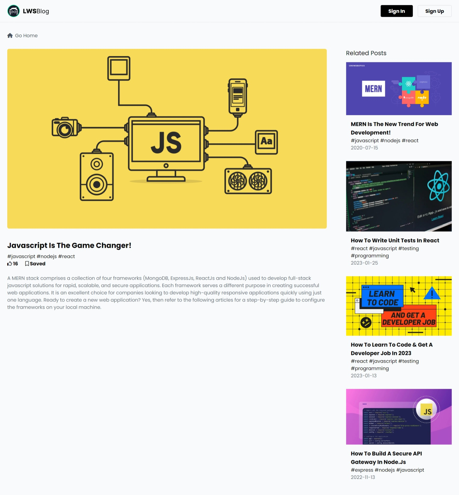
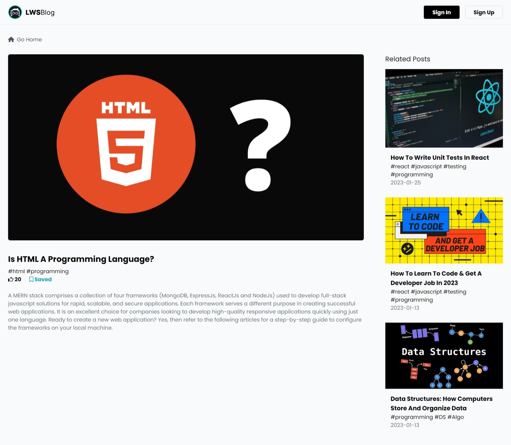

| **sort : default** | **filter : all** |

| **sort : newest** | **filter : all** |

| **sort : most_liked** | **filter : all** |

| **sort : default** | **filter : saved** |

| **sort : newest** | **filter : saved** |

| **sort : most_liked** | **filter : saved** |

| **detailed post** | **saved : false** |

| **detailed post** | **saved : true** |

